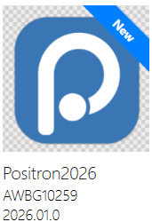
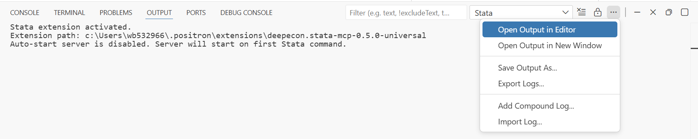
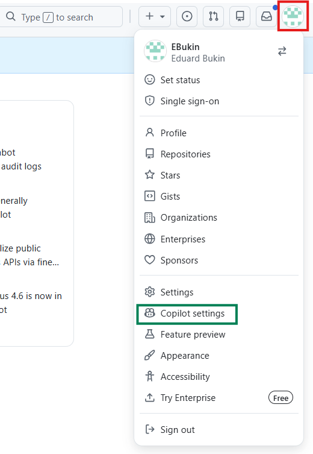
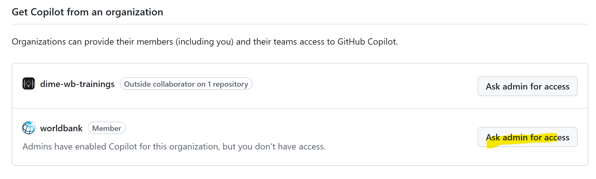
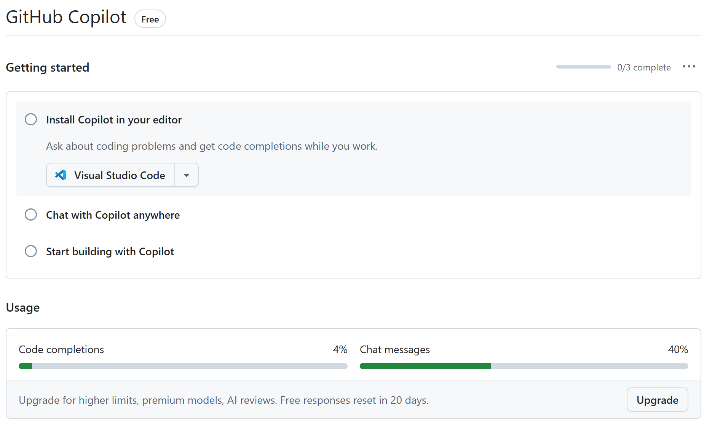
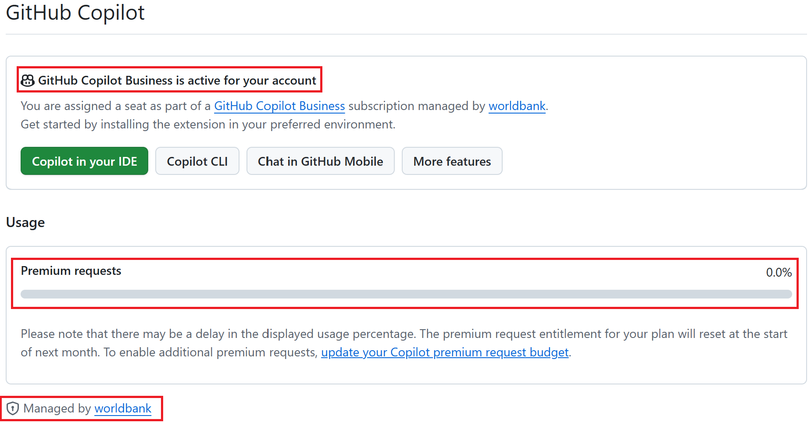

## Goals:

- Setup software for AI agent-assisted analysis in Stata and R
- Enable AI-assistance with GitHub Copilot or Claude AI integration
- Be able to reproduce AI-assisted coding workflow demonstrated in the
  seminar

## Overview

To be able to use AI in daily coding and data analysis we need to:

1.  [Software setup]{#software-setup}:

    - Stata, R, Python, Positron, Quarto, Git
    - Python package `uv`
    - Extensions in Positron (Stata MCP)

2.  GitHub setup:

    - Create a GitHub account using private email (not WB email).
    - Join World Bank GitHub organization.
    - Request GitHub Copilot access from World Bank GitHub organization
      administrators.
    - For a private setup, you need to make a
      [subscription](https://github.com/features/copilot/plans){target="_blank"}
      to GitHub Copilot Pro or Pro+ plan.

3.  Connect GitHub Copilot to Positron and enable Positron Assistant in
    Positron settings.

### Known Issues and Troubleshooting {#troubleshooting}

- If you have trouble installing software from the Software Center,
  contact IT Help:
  [ITHelp\@worldbankgroup.org](mailto:mailto:ITHelp@worldbankgroup.org)
  or use [Walk-in
  center](https://worldbankgroup.sharepoint.com/sites/itsupport/SitePages/PublishingPages/Walk-in-Centers-in-Washington-DC--05042021-1608401_new.aspx).

- If you have trouble with GitHub World Bank or Github Copilot access
  from World Bank [GitHub setup instructions](#github-setup) or contact
  [github\@worldbank.org](mailto:github@worldbank.org).

- GitHub Copilot does not work in Positron after installation:

  - Make sure you [set-up GitHub account properly](#github-setup)

  - Make sure that you have [**enabled Positron Assistant in Positron
    settings**](#enable-positron-assistant)

  - Make sure you are [signed into GitHub in
    Positron](#positron-copilot-setup)

  - Reload Positron after installation and setup: `Ctrl+Shift+P` \>
    `Developer: Reload Window` \> `Enter` or close it and open again.

- Stata-MCP extension does not run Stata code from the OneDrive.

  This was a known issue with Stata MCP extension that **has been
  resolved** after [this GitHub
  issue](https://github.com/hanlulong/stata-mcp/issues/52). It happened
  when running code from OneDrive folder because our one drive folder
  has a space in the name ("OneDrive - WBG"). A workaround is to move
  the code to a different folder without spaces in the path, for example
  `C:\Users\wbXXXXXXX\code`, and run it from there. Once this issue it
  resolved on the Stata MCP extension side, it will update in positron
  automatically and you will be able to run code from the OneDrive
  folder again.

## Software setup

### Step 1: Install the software

First you need to install the required software on your computer. The
table below summarizes the software needed and instructions for
installation.

|   | Software | Note for self-installation |
|-------------------|-------------------------------|-----------------------|
| {width="47"} | **Stata** 19 or higher | Use regular installation |
| {width="40"} | **Positron** Latest | Use user-level installation |
| {width="40"} | **Quarto** 1.9.+ (latest) | Use admin-level (for all users) installation |
| {width="52"} | **R** 4.5.2 (latest) | Use regular installation |
| {width="47"} | **Python** 3.13+ (latest) | Use regular installation |
| {width="48"} | **Git** 2.52+ (latest) | Use regular installation |

All software listed above is available for installation at the World
Bank through the Software Center. Go to the Software Center and install
it (if not already installed)
{width="255"}. If some is not available
in the Software Center, make a [Software Installation
Request](https://worldbankgroup.service-now.com/wbg/en/software-installation-request?id=wbg_sc_catalog&sys_id=bd1e71b86f16d340db112d232e3ee4b7&table=sc_cat_item&searchTerm=Software%20installation){target="_blank"}
or contact IT Help:
[ITHelp\@worldbankgroup.org](mailto:ITHelp@worldbankgroup.org).

::: callout-note
If you had an older version of Positron installed, please reinstall it
as the one on the software center is more up to date and capable of
self-updating.

Private laptop setup

- R: Install R from
  [https://cran.r-project.org/](https://cran.r-project.org/){target="_blank"}
- Python: Install Python from
  [https://www.python.org/downloads/](https://www.python.org/downloads/){target="_blank"}
- Positron: Install user-level Positron from
  [https://positron.posit.co/download.html](https://positron.posit.co/download.html){target="_blank"}
- Quarto: Install Quarto from
  [https://quarto.org/docs/get-started/](https://quarto.org/docs/get-started/){target="_blank"}
- Git: Install Git from
  [https://git-scm.com/download/win](https://git-scm.com/download/win){target="_blank"}
:::

### Step 2: Configure the software and install extensions

#### UV: Required Python Package {#python-uv}

1.  Open Command Prompt (cmd) or PowerShell:

    - Press `Win + R`, type `cmd` or `powershell`, and hit Enter.

2.  Type `pip install uv` and press Enter to install the `uv` package.

    - `uv` is a package that allows environments management in python,
      see
      [https://pypi.org/project/uv/](https://pypi.org/project/uv/){target="_blank"}

3.  Check if UV is installed correctly by typing `uv --version` in the
    Command Prompt or PowerShell. You should see the version number
    displayed, something like this:

    ``` pwsh
    uv 0.9.18 (0cee76417 2025-12-16)
    ```

#### Stata-MCP: Extensions in Positron for Stata {#stata-mcp-extension}

Extensions in Positron are add-ons that enhance functionality. To
install extensions, open the Extensions panel by clicking the square
icon {width="28"} on the left sidebar or pressing
`Ctrl+Shift+X`. There are many extensions available for Positron. Below
are the key extensions to install for AI-assisted analysis:

[`Stata MCP`
Extension](https://open-vsx.org/extension/DeepEcon/stata-mcp){target="_blank"}
enables Model Communication Protocol (MCP) for Stata, providing better
context awareness for AI agents and allowing you to run Stata code
directly from Positron.

**To install it**:

|   | Description |
|---------------------------------------|---------------------------------|
| {width="45"} | Open the Extensions panel in Positron |
| {width="300"} | Search for "Stata MCP" in the Extensions panel |
| {width="300"} | Click "Install" to add the extension to Positron |
| {width="300"} | After installation, restart Positron or reload the window (`Ctrl+Shift+P` \> `Developer: Reload Window` \> `Enter`) |

**Once installed**, configure the Stata MCP extension by setting up the
path to the Stata executable and Stata edition.

|   | Description |
|------------------------------------|------------------------------------|
| {width="350"} | Open [stata-vscode.stataPath](positron://settings/stata-vscode.stataPath) or press `Ctrl+,` \> search "Stata Path" (or `stata-vscode.stataPath`), and set it to your Stata executable folder: `C:\Program Files\StataNow19\` (for most WB laptops and VDIs). |
| {width="281"} | Open [stata-vscode.stataEdition](positron://settings/stata-vscode.stataEdition) or press `Ctrl+,` \> search "Stata Edition" (or `stata-vscode.stataEdition`), and set it to "mp" for Stata MP version. |

**Verify Stata MCP is working**

Create and save a new Stata `.do` file with a simple command like:

``` stata
sysuse auto
summarize price
display "Stata is working!"
```

|   | Description |
|------------------------------------|------------------------------------|
|  | Save the file (`Ctrl+S`) before running — any unsaved edits will not be executed. |
| {width="40"} | Press `Ctrl+Shift+D` in the `.do` file, or `Ctrl+Shift+P` \> `Stata: Run Current File` \> `Enter`, or click the run button. |
| {width="400"} | Results appear in the `Output` panel: `Ctrl+Shift+P` \> `Output: Show Output Channels...` \> `Enter` \> `Stata`. |
| {width="400"} | You can move the Output panel to a different location in Positron using the button shown. |

## GitHub and GitHub Copilot Setup {#github-setup}

GitHub setup includes

1.  creating a GitHub account,

2.  joining the World Bank GitHub organization, and

3.  requesting access to GitHub Copilot.

4.  for private developers, instead of joining the World Bank GitHub
    organization, you can get access to GitHub Copilot through a private
    [subscription](https://github.com/features/copilot/plans){target="_blank"}
    to GitHub Copilot Pro or Pro+ plan.

5.  Monitor your usage of premium requests in GitHub Copilot:

    1.  Go to: [GitHub \> Settings \> Copilot
        settings](https://github.com/settings/copilot/features){target="_blank"}
    2.  Scroll down to the "Usage" section to see your usage of premium
        requests.
    3.  100% is the monthly limit of 300 premium requests from GH
        Copilot from the WB. If you have a private Pro or Pro+
        subscription, you have 500 and 1500 requests respectively.

These steps can be done independently and give different privileges to
users, see table below.

| Access Level | GitHub Permissions | GitHub Copilot / AI Assistance | WB GitHub Org Access |
|-----------------|-----------------|--------------------|------------------|
| **No GitHub Account** | ❌ No: view public repos only | ❌ No | ❌ No (only view public repositories) |
| **Personal GH Account**<br/>(created at github.com) | ✅ Everything: Create personal repos, collaborate | ⚠️ **Usage limit**. **No access to Claude** | ❌ No |
| **+ GH Copilot subscription** ([Copilot Pro or Pro+](https://github.com/features/copilot/plans){target="_blank"}) | ✅ Everything | ✅ **Unlimited code completion + Chat**. ⚠️ Monthly use limit on **Agent**<br/>Private budget for over-limit use.<br/>✅ **Premium models (Claude)** | ❌ No |
| **WB Organization Member**<br/>(join via eServices) | ✅ Access WB public and internal repos.<br/>Create repos under WB org | ⚠️ Limited (basic completions only; no premium models). | ✅ Yes (view / contribute) |
| **WB Org + WB Copilot Access**<br/>(request Copilot via GitHub Settings and email to github\@worldbank.org) | ✅ Everything: personal repos + WB org repos | ✅ **Unlimited code completion + Chat**. ⚠️ Limit on **Agent** (300 requests/month)<br/>✅ **Premium models (Claude, GPT-4.5)**<br/>Manager-approved budget for overuse. | ✅ Yes |

**Key takeaways:**

- **For AI-assisted coding:** You need *at minimum* "Private GH
  account + Copilot Access (private Pro subscription or from World Bank
  GitHub)"
- **To be able to use GitHub Copilot with Claude:** You need Copilot
  Access (private Pro subscription or from World Bank GitHub)
- **Email matters:** Always use your personal email, not your WB email,
  when creating your GitHub account

### Step 1: Create a GitHub Account

If you don't have a GitHub account yet, create one at
[https://github.com/signup](https://github.com/signup){target="_blank"}
or read more [GH:
get-started](https://docs.github.com/en/get-started/learning-about-github/types-of-github-accounts#personal-accounts)

::: callout-warning
**Note: Use your personal email address, not your World Bank email**.
:::

### Step 2: Join the World Bank GitHub Organization

1.  Submit a "[Join GitHub Organization Account
    Request](https://worldbankgroup.service-now.com/wbg/en/join-github-organization-account-request?id=wbg_sc_catalog&sys_id=910e1739db1a54903c5960ab13961912&table=sc_cat_item&searchTerm=github){target="_blank"}"
    on eServices to join
    [github.com/worldbank](https://github.com/worldbank){target="_blank"}

2.  Once your request is approved, you will receive an email invitation
    to join the World Bank GitHub organization

    - **Email will be sent to the email address associated with your
      GitHub account**

3.  Accept the invitation by clicking the link in the email

    - You need to confirm your membership in the World Bank organization
      on GitHub by following steps indicated in the email.

    - If you don't confirm within a few days, the invitation will
      expire, and you will need to request again through eService.

### Step 3: Request GitHub Copilot Access from World Bank GitHub Organization

**After joining the World Bank organization**, request GitHub Copilot
access. To do this:

::::: columns
::: {.column width="75%"}
Go to [GitHub \> Settings \> Copilot
settings](https://github.com/settings/copilot){target="_blank"}.
:::

::: {.column width="25%"}
{width="100%"}
:::
:::::

::::: columns
::: {.column width="50%"}
- Scroll all the way down to the "Get Copilot from an organization"
  section and click the "**Request access**" button from the worldbank
  organization.

- Send an email to
  [github\@worldbank.org](mailto:github@worldbank.org) with the subject
  line: "Request GitHub Copilot Access". In the email body, include your
  **GitHub username** and a **brief reason for requesting access**. Copy
  your manager or team lead for approval.
:::

::: {.column width="50%"}
{width="100%"}
:::
:::::

Your request will be reviewed and approved by the GitHub organization
administrators.

::: callout-tip
**Tip:** [Bryan Cahill](mailto:bcahill@worldbankgroup.org) and
[github\@worldbank.org](mailto:github@worldbank.org) lead the
github.com/worldbank organization and can help with Copilot access
requests.
:::

::: callout-warning
**Warning:** If you don't see the "Request access" button or worldbank
organization, it means you either:

- were not added to the World Bank GitHub organization yet, or
- did not accept the invitation in due time.

Please complete Step 2 above, wait for the invitation email, and accept
it before requesting GH Copilot access.
:::

Once approved, you'll be able to use GitHub Copilot in Positron

### Step 4: Verify GitHub Copilot Access

In github.com, go to [GitHub \> Settings \> Copilot
settings](https://github.com/settings/copilot){target="_blank"} and
verify that you have access to GitHub Copilot through the World Bank
organization. Your usage statistics will look like this:

::::: columns
::: {.column width="50%"}
**No access to Copilot from World Bank GitHub organization or personal
plan Pro or Pro+**

{width="100%"}
:::

::: {.column width="50%"}
**Access to Copilot from World Bank GitHub organization or personal plan
Pro or Pro+**

{width="100%"}
:::
:::::

Another way is to check if you have access to premium models like
Anthropic Claude or GPT-4.5 in the Positron Assistant settings (see
instructions below).

1.  Open Positron and sign in to your GitHub account (see "Connecting
    GitHub Copilot to Positron" section above)

2.  Check that the GitHub Copilot extension is active in the Extensions
    panel

3.  Try typing a comment in a code file to verify that Copilot
    suggestions appear

Note: If you have access to GitHub Copilot but don't see suggestions in
Positron, make sure you are signed into GitHub in Positron and that the
GitHub Copilot extension is installed and enabled.

### Step 5: To enable overuse of GitHub Copilot Agent

1.  Ask your manager for permission to use a budget code for overuse of
    GitHub Copilot Agent
2.  Set up a monthly limit of usage (you will be charged only for what
    you use)
3.  Contact [github\@worldbank.org](mailto:github@worldbank.org) asking
    to set a budget for your account and provide the budget code
    approved by your manager (copy manager in the email for approval
    confirmation).

## Positron + GitHub Copilot / Anthropic Claude Setup {#positron-copilot-setup}

This step enables you to use the GitHub Copilot coding agent and other
LLMs, such as ChatGPT or Anthropic Claude, with Positron.

See [Positron Assistant: Getting
Started](https://positron.posit.co/assistant-getting-started.html#step-3-use-positron-assistant)
for the full overview of what it does.

::: callout-warning
**Warning:** Sometimes it is needed to reload Positron after installing
software or extensions for the changes to take effect.
:::

### Step 1: Connect GitHub to Positron

This requires a GitHub account linked to the World Bank organization.
See [GitHub Setup](#github-setup) instructions above if you don't have
an account or haven't linked it to the WB organization. To connect GitHub
to Positron:

|   | Note |
|-----------------------------------------------|-------------------------|
| {width="32"} | Open `Account` menu |
| {width="300"} | Click `Sign in to your GitHub account` |
| {width="430"} | Authorize GitHub in your browser |
| {width="300"} | Confirm the authorization request |
| {width="300"} | Complete the authentication process |
| {width="300"} | Grant necessary permissions |
| {width="300"} |  |

See also [Positron Assistant
Guide](https://positron.posit.co/assistant.html) for more details on
connecting GitHub and using the assistant.

### Step 2: Enable Positron Assistant in Positron Settings {#enable-positron-assistant}

1.  Open settings
    [positron.assistant.enable](positron://settings/positron.assistant.enable)
    and check the box to enable it. or `Ctrl+,` \>
    `positron.assistant.enable` \> Check the box
    {width="300"}

2.  Restart Positron to apply the changes\
    or reload the window (`Ctrl+Shift+P` \> `Developer: Reload Window`
    \> `Enter`) {width="450"}

See [Enable Positron
Assistant](https://positron.posit.co/assistant-getting-started.html#step-1-enable-positron-assistant)
for more details.

### Step 3: Configure LLM Provider

By default, when logged into GitHub, Positron Assistant uses GitHub
Copilot as the LLM provider. GitHub Copilot provides code completion,
answers questions in chat, and operates in agent mode (able to run code
directly).

::: callout-tip
Within GitHub Copilot, you can also configure other LLM providers, such
as Anthropic Claude, OpenAI GPT, etc.
:::

If you want to use Anthropic Claude or other LLMs as the provider,
follow instructions in [Configure language model
providers](https://positron.posit.co/assistant-getting-started.html#step-3-use-positron-assistant){target="_blank"}.

::: callout-note
Code completion will still be provided by the GitHub Copilot extension
or will not work with Anthropic Claude.
:::

### Step 4: Use Positron Assistant

1.  `Ctrl+Shift+P` \> `Help: Ask Positron Assistant` \> `Enter` to open
    it.

2.  In the input box that appears, type your question. For example:

    ```
    Write a Stata do file that loads the auto dataset and summarizes the price variable.
    Open it.
    Explain how to run it.
    ```

To learn more about using Positron Assistant, see [Use Positron
Assistant](https://positron.posit.co/assistant-getting-started.html#step-3-use-positron-assistant){target="_blank"}

## Additional Resources

- [Positron Documentation](https://positron.posit.co/){target="_blank"}
- [GitHub Copilot
  Documentation](https://docs.github.com/en/copilot){target="_blank"}
- World Bank GitHub:
  [https://github.com/worldbank](https://github.com/worldbank){target="_blank"}

## Support {#support}

For help with setting up or troubleshooting the software, contact:

- IT Help:
  [ITHelp\@worldbankgroup.org](mailto:ITHelp@worldbankgroup.org)

- HQ [Walk-in
  center](https://worldbankgroup.sharepoint.com/sites/itsupport/SitePages/PublishingPages/Walk-in-Centers-in-Washington-DC--05042021-1608401_new.aspx)

Remember to provide assisting person with these setup instructions.

For help with accessing GitHub.com/Worldbank or GitHub Copilot from the
worldbank:

- Check: [GitHub Setup](#github-setup) instructions above

- Reach out to: [github\@worldbank.org](mailto:github@worldbank.org)
